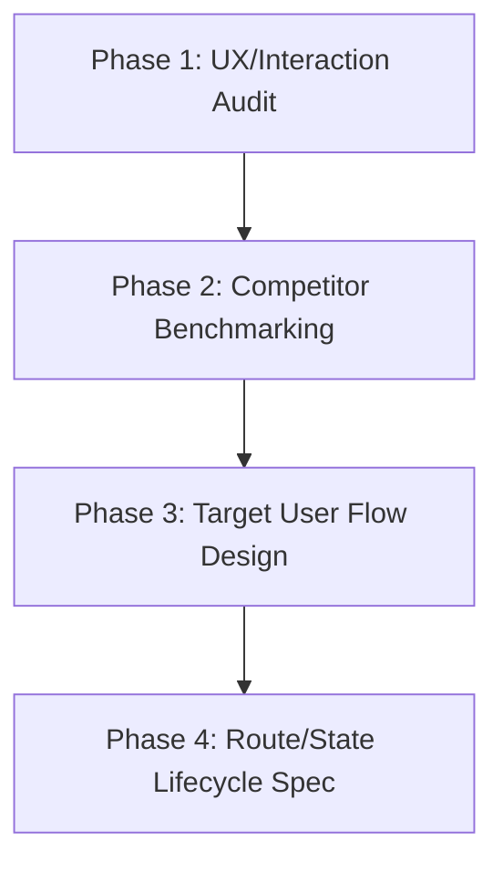

# Frontend Refactoring Flow Skill

This skill guides you through the industry-standard workflow for frontend refactoring. It focuses on auditing current flows, analyzing competitors, designing target routing, and specifying state lifecycles before writing code.

---

## Workflow Overview

When refactoring a frontend feature's routing or interaction model, follow these four phases sequentially:

---

## Phase 1: UX & Interaction Audit (定义与审计)

**Goal:** Analyze the current implementation, map code to UX flows, and identify interaction pain points.

### Instructions:
1. **Walkthrough Scenarios:** Manually run through the key user scenarios of the feature being refactored.
2. **Locate Code Assets:** Find and catalog the relevant source files, route configurations, page widgets, and controllers.
3. **Document Friction Points:** Create an audit report classifying issues into:
   - **Broken Flow (动线中断):** Actions that unexpectedly exit the current task or destroy session context (e.g., closing a workflow to open a sub-tool).
   - **Opaque State (状态不透明):** Lack of progress indicators, metrics, or feedback (e.g., no status readouts, raw database/internal strings showing to the user).
   - **Control Lie (控件撒谎):** Interactive-looking UI elements that are static, disabled, or misleading.
   - **Coupling Pain (代码耦合):** Structural problems where UI routes are tightly bound to background services (e.g., page navigation tied directly to background process/daemon state).

---

## Phase 2: Competitor & Reference Benchmarking (竞品与标杆研究)

**Goal:** Research how leading products structure their routing topologies and solve interaction transitions for similar features.

### Instructions:
1. **Identify Reference Apps:** Pick direct competitors and indirect/analogy products that implement a similar user journey.
2. **Analyze Route Topographies:** Map out the page hierarchy of the reference apps (e.g., Main Dashboard -> Selection/Configuration -> Immersive Session -> Summary/Complete).
3. **Analyze Edge Cases & Transitions:**
   - **Non-destructive Sub-tasks:** How do they allow users to perform sub-tasks without resetting the primary session? (e.g., modal overlays, bottom sheets, sub-route pushes).
   - **Exit Protection:** What happens if the user presses back or attempts to leave mid-session? (e.g., confirmations, auto-saving progress).
   - **Session Completion:** How do they handle the transition to completion? (e.g., metrics presentation, redirection to main dashboard).

---

## Phase 3: Target User Flow Design (设计目标工作流)

**Goal:** Design a clean, optimized "To-Be" routing flow that eliminates the audit pain points and incorporates benchmarking insights.

### Instructions:
1. **Define the Primary Path:** Design a single-line, uninterrupted flow for the main user task from start to finish.
2. **Define Branching Interactions:** Explicitly design sub-tasks as non-destructive actions:
   - Use Bottom Sheets (drawers), Dialog overlays, or push-and-return routes.
   - Ensure returning from a sub-task resumes the primary task exactly where the user paused.
3. **Map the Routing Transition:**
   - Create a Mermaid routing diagram showing the flow.
   - Contrast the "Before" vs. "After" states of the navigation stack.

---

## Phase 4: Route & State Lifecycle Specification (状态与生命周期规范)

**Goal:** Define the formal states, transitions, and guards of the pages involved in the refactored flow.

### Instructions:
1. **Define Lifecycle States:** Map out the states of the session page/view:
   - `Active`: Primary task is active (e.g., timers running, main task interface active).
   - `Paused`: Primary task is temporarily suspended (e.g., sub-overlay is open, background processes paused, but state is preserved).
   - `Completed`: Task finished (transitions to the summary view).
   - `Disposed`: Resources cleaned up.
2. **Establish Exit Guards:** Specify how to protect user progress from accidental exits (e.g., using route navigation guards or system back-button hooks to intercept back actions and show a confirmation prompt).
3. **Create the Transition Matrix:** Outline which user events or system triggers cause a transition between states.
